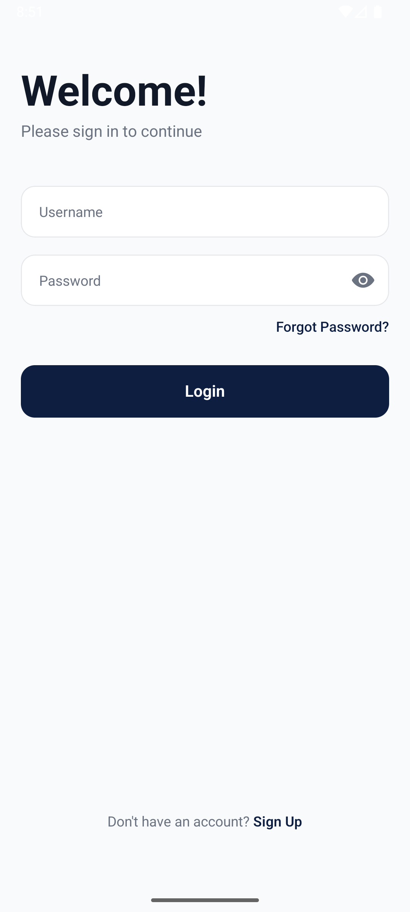
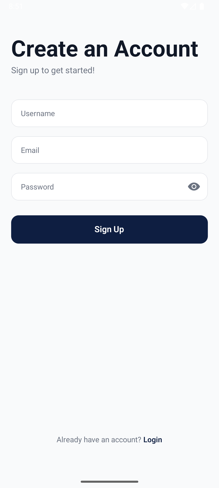
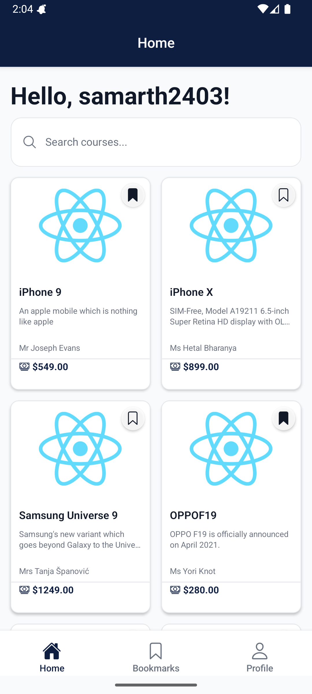
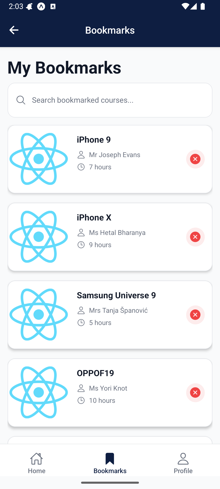
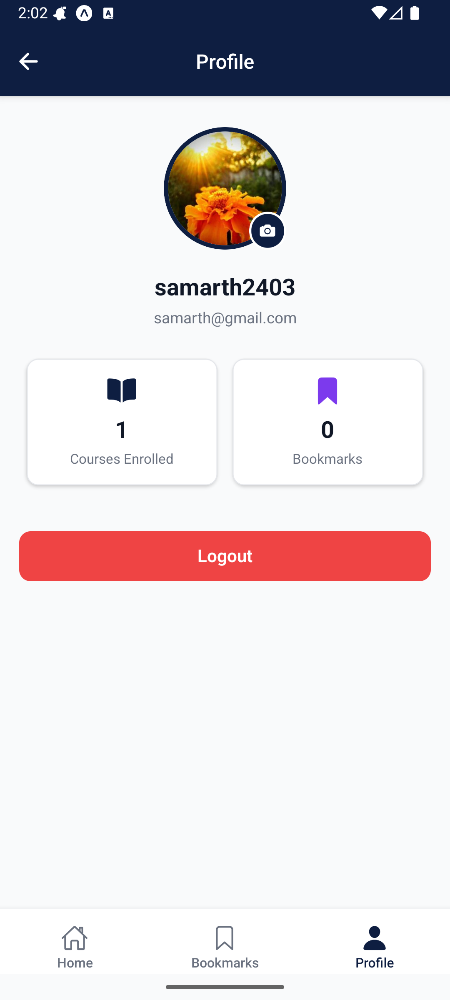
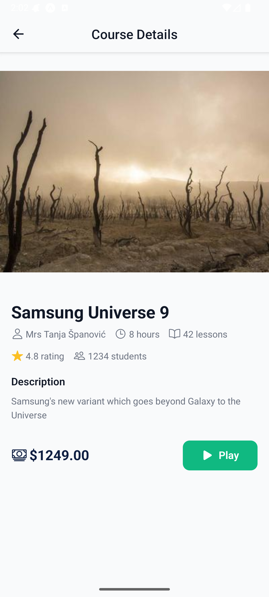
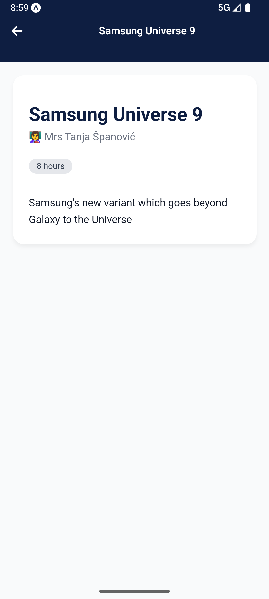
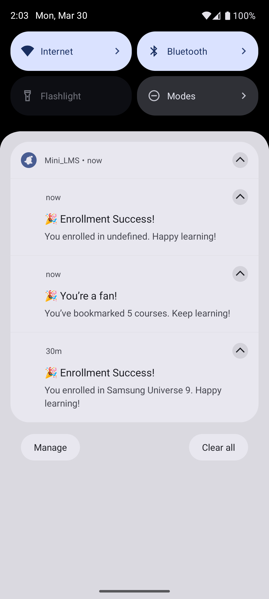

# Mini_LMS – React Native Expo LMS App

A full‑featured Learning Management System mobile app built with React Native Expo. Demonstrates advanced state management, native features, WebView integration, and production‑ready practices.

---

##  Features

- **Authentication** – Login/register with username/password, token stored in SecureStore, auto‑login on restart, logout.
- **Course Catalog** – Fetches courses from `/public/randomproducts` and instructors from `/public/randomusers`, merges them, and displays in a responsive grid with search, pull‑to‑refresh, and bookmark toggle.
- **Course Details** – Full description, instructor, price, and an **Enroll** button (local storage). After enrollment, a **Play** button opens a WebView.
- **Bookmarks** – Persist bookmarks with AsyncStorage; view and remove from dedicated tab.
- **Profile** – User info, avatar picker (local), enrolled courses and bookmarks counts, logout.
- **WebView** – Loads a local HTML template, injects course data, and sends custom headers (native→web communication).
- **Local Notifications** – Permission request; shows notification when user bookmarks ≥5 courses; reminds if inactive for 24 hours; bonus notification on enrollment.
- **Offline Mode** – Banner when offline, queries pause until connection returns.
- **State Management** – Zustand (global state) + TanStack Query (server state) with persistence.
- **Responsive UI** – NativeWind (Tailwind) with custom color palette.

---

## 🛠️ Tech Stack

| Category          | Technologies |
|-------------------|--------------|
| Framework         | React Native (Expo SDK) |
| Language          | TypeScript (strict) |
| Navigation        | Expo Router |
| Styling           | NativeWind (Tailwind CSS) |
| State Management  | Zustand + TanStack Query |
| Storage           | Expo SecureStore, AsyncStorage |
| API Client        | Axios with interceptors |
| Forms & Validation| React Hook Form + Yup |
| Notifications     | Expo Notifications |
| Network           | @react-native-community/netinfo |
| Icons             | @expo/vector-icons |
| WebView           | react-native-webview |
| Build & Deploy    | EAS Build (APK) |

---

## 📂 Project Structure

Mini_LMS/
├── app/ # Expo Router screens
│ ├── (auth)/ # login, register
│ ├── (tabs)/ # home, bookmarks, profile
│ ├── course/[id].tsx # course details
│ └── webview/viewer.tsx # WebView screen
├── src/
│ ├── api/ # Axios clients & endpoints
│ ├── services/ # Business logic (merge courses, notifications)
│ ├── store/ # Zustand stores (auth, course, enrollment)
│ ├── hooks/ # Custom hooks (useCourses, useNetwork)
│ ├── components/ # Reusable UI (CourseCard, SearchBar, etc.)
│ ├── storage/ # SecureStore, AsyncStorage wrappers
│ ├── types/ # TypeScript interfaces
│ ├── config/ # QueryClient, constants, env
│ └── utils/ # Helpers, errorHandler
├── assets/ # Images, local HTML template
├── .env # Environment variables (ignored)
├── app.config.js # Expo config with env loading
└── eas.json # EAS build profiles (development, production)

---

##  Setup Instructions

###  Clone the Repository

```bash
git clone https://github.com/Asujit/Mini_LMS.git
cd Mini_LMS

---

## Install Dependencies

npm install


## Set Up Environment Variables

API_BASE_URL=https://api.freeapi.app/api/v1


---

## Run the App

npx expo start


## Key Architectural Decisions

Separation of concerns: API, services, stores, hooks, and components are layered for maintainability.

State Management: Zustand for client‑state (auth, bookmarks, enrollment) with persistence; TanStack Query for server‑state (courses) with caching and automatic retries.

Type Safety: Strict TypeScript with inference using yup and typed stores.

Native Features: SecureStore for tokens, AsyncStorage for bookmarks, Expo Notifications for local reminders, NetInfo for offline detection.

WebView Communication: Injected JavaScript to update local HTML template; custom headers to demonstrate native→web data transfer.

Error Handling: Axios interceptors for global error handling and retries; user‑friendly alerts.

Performance: FlatList with memoization and keyExtractor, useCallback where appropriate.


---

## Known Issues / Limitations

Token Refresh: The interceptor expects a /users/refresh-token endpoint; if not provided by the API, refresh will fail and logout. A fallback is not implemented.

List Optimization: The spec mentions LegendList; we used FlatList with memoization and keyExtractor for simplicity. Replace with LegendList for extra performance.

Avatar Update: The profile picture is stored locally, not synced with the backend.

Instructor Images: Not displayed; only instructor name from /randomusers.

Duration & Lessons: Static placeholders; not yet fetched from API.

24‑hour Reminder: Triggered on app foreground, not scheduled in advance (still meets requirement).

WebView HTTP Cleartext: On Android 9+, HTTP URLs require usesCleartextTraffic: true in app.config.js. Already added.


---

## Building a Production APK

eas build --platform android --profile production

## Screenshots










## Demo Video

link - 


## Author

Sujit Auti

